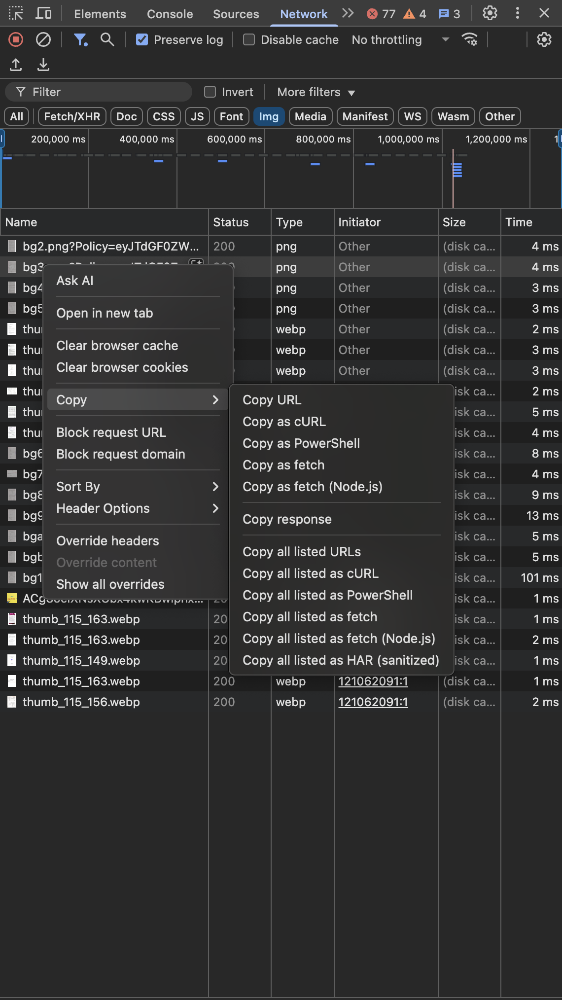

# Studocu PDF Scraper

A Python script to download and combine document pages from Studocu into a PDF file.

## Requirements

- Python 3.11 or higher
- [uv](https://github.com/astral-sh/uv) (optional) - Fast Python package installer and resolver

## Installation

1. Clone the repository:

```bash
git clone https://github.com/aabishkaryal/scrapper.git
cd scrapper
```

2. Install dependencies:

Using uv (recommended):

```bash
uv venv
source .venv/bin/activate  # On Unix/macOS
# or
.venv\Scripts\activate     # On Windows

uv sync
```

Using pip:

```bash
python -m venv .venv
source .venv/bin/activate  # On Unix/macOS
# or
.venv\Scripts\activate     # On Windows

pip install -r requirements.txt
```

## Usage

### Getting the Document URL

1. Visit the Studocu document page in your browser
2. Open Developer Tools:
   - Chrome/Edge: Press `F12` or `Ctrl+Shift+I` (Windows/Linux) or `Cmd+Option+I` (macOS)
   - Or right-click anywhere on the page and select "Inspect"
3. Switch to the "Network" tab in Developer Tools
4. In the Network tab:
   - Click on the "Img" filter button
   - Scroll through the document to load more pages
   - Look for requests named `bg2.png` or `bg3.png` or similar
   - Right-click on the request → Copy → Copy URL



### Running the Script

The script can be run in two ways:

#### 1. Command Line Arguments

```bash
python studocu.py "URL" NUMBER_OF_PAGES
```

#### 2. Interactive Mode

Simply run the script without arguments:

```bash
python studocu.py
```

The script will prompt you for:

1. Document URL (containing bgX.png pattern)
2. Total number of pages

## Output

The script will:

1. Download all pages with a progress bar
2. Automatically retry failed downloads if any
3. Combine all pages into a single PDF file named `output.pdf`

## Dependencies

- aiohttp: For asynchronous HTTP requests
- Pillow: For image processing and PDF creation
- tqdm: For progress bars
- aiofiles: For asynchronous file operations
